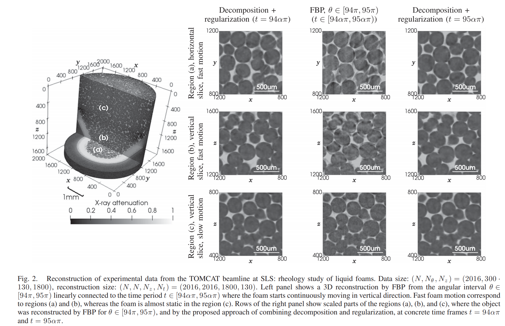

================
RecTVGPU
================

**rectv_gpu** is a C++ module with python wrapper for multi-GPU for four-dimensional (3D+time) tomographic reconstruction by time domain decomposition. For details, see
Nikitin, Viktor V., et al. "Four-dimensional tomographic reconstruction by time domain decomposition." IEEE Transactions on Computational Imaging 5.3 (2019): 409-419.(https://ieeexplore.ieee.org/abstract/document/8637033)

The module provides a tomographic reconstruction method, which relaxes the requirement of quasistatic samples during data acquistion. Dynamic tomographic data sets are decomposed in the temporal domain by projecting to a lower dimensional subspace of basis functions and deploying an additional L1 regularization technique where the penalty factor is taken for spatial and temporal derivatives. The iterative scheme involves solving the projected regularization problem with using modern multi-GPU systems.

Example of reconstruction:

================
Installation
================
Installation from source
================
::

  git clone https://github.com/nikitinvv/rectv_gpu
  cd rectv_gpu; python setup.py install

Installation at MAX IV synchrotron cluster
================
::

  module add  GCC/8.2.0-2.31.1 icc/2019.1.144-GCC-8.2.0-2.31.1 ifort/2019.1.144-GCC-8.2.0-2.31.1 CUDA/10.1.105
  conda install -c conda-forge dxchange scikit-build matplotlib notebook ipywidgets
  cd rectv_gpu; python setup.py install

Use MAX IV gn1-3 nodes for remote jupyter notebook

Allocate GPU resources::

  salloc -p v100

In remote host (e.g. gn1), open the terminal, change directory to where you have your notebooks and type::

  jupyter notebook --no-browser --port=<port1>

E.g. port1=13543

On your local computer type::

  ssh -N -f -L localhost:<port2>:localhost:<port1> username@address

E.g. port2=13545, address=w-picard05-clu0-gn-1.maxiv.lu.se

Now open web browser (google chrome, firefox, ...) and type::

  localhost:<port2>
  
Examples with jupyter notebook

See examples/

================
Developers
================
Viktor Nikitin (vnikitin@anl.gov)

